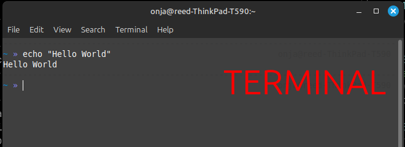
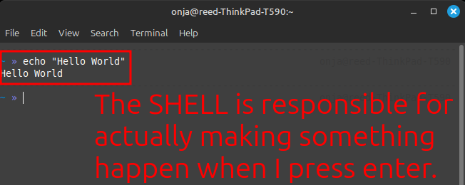
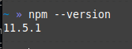
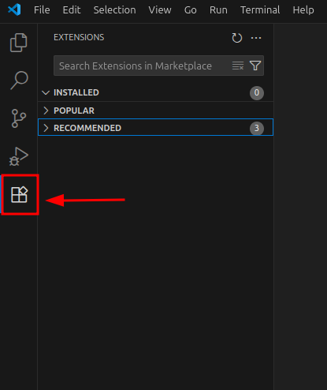

# Part 1: Setting Up Your JavaScript Development Environment

*Time: 1 hour*

## Welcome to Real Programming

You've been writing HTML and CSS, styling beautiful web pages. But now we're crossing into a new territory: **programming**. JavaScript isn't just about making things look good—it's about making things *happen*. 

Today you'll set up the tools that will be your companions for the rest of your JavaScript journey.

## What You'll Understand By the End

- What those mysterious `npm install` commands were actually doing
- Why VS Code, Node, and npm work together as a team
- How your computer's terminal works (and why VS Code's terminal is the same thing)

---

## The Big Picture: Your Development Ecosystem

Before we dive into installation, let's understand what we're building. Think of your development environment like a workshop:

- **VS Code** = Your workbench (where you craft your code)
- **Node.js** = The engine that runs JavaScript on your computer
- **Web Browser** = The engine that runs JavaScript (and interprets HTML and CSS) on the web
- **npm** = The massive shared toolbox where millions of developers contribute tools (some help you *build* things, others *become part* of what you build)
- **Terminal/Shell** = Your direct line to give commands to your computer

### JavaScript's Two Homes

JavaScript originally lived only in web browsers. But now it has two homes:

1. **In the Browser**: Making web pages interactive
2. **On Your Computer (Node.js)**: Building applications, running scripts, powering servers

This is huge! It means you can use the same language for websites AND for programs that run directly on computers.

---

## Demystifying the Command Line

Remember when you ran `npm install` and `npm test`? You were using something called a **terminal** (or **command line**). Let's demystify this before we go further.

### What is a Terminal?

A terminal is simply a text-based way to give commands directly to your computer. Instead of clicking buttons and icons, you type what you want to do. "Terminal" refers to the application that provides this text interface (which might be called Terminal, Command Prompt, PowerShell, etc. depending on your operating system, or could be integrated into an editor like VS Code). The key is that a terminal refers to **the place where you type commands**.



### What is a Shell?

A shell is the interpreter that understands your text commands. Common shells include:
- **bash** (common on older systems)
- **zsh** (common on newer Mac systems)
- **PowerShell** (Windows)

Don't worry about the differences—they all do basically the same thing. The key is that the shell is what processes your commands and tells your computer what to do **after** you've typed them into the terminal and pressed enter.



### VS Code Terminal vs "Real" Terminal

Here's something that confuses many beginners: **The terminal inside VS Code is exactly the same as opening your computer's terminal application.** 

VS Code just gives you convenient access to your computer's terminal without leaving your code editor. When you press ``Ctrl + ` `` (or ``Cmd + ` `` on Mac) in VS Code, you're opening the same terminal you could access through your computer's Terminal or Command Prompt application.

### The Concept of "Where Am I?"

Your terminal is always **pointing** to some location on your computer—to a specific folder (called a directory). This is why sometimes commands work and sometimes they don't:

- When you open VS Code's terminal, it starts in your project folder
- When you open your computer's terminal, it might start in your home folder
- Commands like `npm install` look for files like `package.json` in the current folder (so if you open the terminal in the wrong folder, it won't find them when you run the command)

You can always see where you are by typing `pwd` (print working directory).

You will often use commands like `cd` (change directory) to navigate to the right folder. For example, `cd ~` takes you to your home folder. `cd ..` takes you up one folder. `cd foldername` takes you into a folder called `foldername`.

---

## Installation Guide

Even if you already have these tools installed, it's worth understanding what each one does and how to install them fresh (for future reference or new computers). But if you do have them installed, you can skip the installation steps and just test that they work.

### 1. Installing VS Code

**What it is:** A free, powerful code editor made by Microsoft.

**Why we use it:** 
- Excellent JavaScript support
- Built-in terminal
- Thousands of helpful extensions
- Used by millions of developers worldwide

**To install:**
1. Go to [https://code.visualstudio.com/](https://code.visualstudio.com/)
2. Download for your operating system
3. Follow the installation instructions

**Test it:** Open VS Code and create a new file. Save it as `test.js` and type `console.log("Hello, world!");`

**Note:** VS Code is not the only free and open-source code editor, but it is a great option for beginners and experienced developers. If you have another favorite code editor and are willing to figure out how to do things in that editor, feel free to use it. Many code editors provide similar functionalities and there is no "correct" editor to use!

> **Terminal Tip:** Did you know that you could open VS Code directly from your terminal? Whatever directory your terminal is in, if you type `code .` (with a space and a dot), it will open VS Code in that directory. This is super handy for quickly jumping into your projects. Someday you may even prefer using the terminal to get around your computer instead of clicking around with a mouse! Seems crazy right now? Just wait!

### 2. Installing Node.js

**What it is:** JavaScript runtime that lets you run JavaScript on your computer (not just in browsers).

**Why we need it:**
- Run JavaScript files directly on your computer
- Comes bundled with npm (package manager)
- Powers many development tools

**To install:**
1. Go to [https://nodejs.org/](https://nodejs.org/)
2. Download the LTS (Long Term Support) version
3. Follow the installation instructions

**Test it:** 
1. Open a terminal (VS Code's terminal or your computer's)
2. Type `node --version`
3. You should see a version number like `v18.17.0`


### 3. Understanding npm (comes with Node.js)

**What it is:** Node Package Manager - a massive library where developers share code tools.

**The key thing beginners find confusing:** npm has two types of packages:
1. **Development tools** (like testing frameworks, build tools) - these run on your computer to help you build things
2. **Runtime libraries** (like utility functions, UI components) - these become part of your final application

Think of it like a workshop: some tools help you build (hammer, saw) while others become part of the final product (screws, paint).

**Why it's amazing:**
- Millions of free, open-source packages
- Handles dependencies automatically
- Standard way JavaScript developers share tools
- Works whether you're building for browsers, servers, or desktop apps

**Test it:**
1. In your terminal, type `npm --version`
2. You should see a version number



---

## Setting Up Your Developer Workspace

Before we start creating files, let's establish a clear system for organizing your work. This will save you from the "where did I put that file?" anxiety that plagues many beginners.

(If you already have an organization system that works for you, you can skip this section! This is just one way that you can structure your directories to stay organized.)

### Creating Your Development Folder Structure

We recommend creating a dedicated space for all your coding work:

1. **Open your terminal** (VS Code's terminal or your computer's)
2. **Navigate to your home directory**: `cd ~`
3. **Create a development folder**: `mkdir development`
4. **Navigate into it**: `cd development`
5. **Create subfolders for different types of work**:
   ```
   mkdir labs        # For Onja lab assignments 
   mkdir scratch     # For practice files and experiments
   mkdir projects    # For larger personal projects
   ```

### Your New Folder Structure

Your development folder should now look like this:
```
~/development/
├── labs/          # Clone your forked lab repositories here 
├── scratch/       # Practice files, experiments, quick tests
└── projects/      # Larger projects and portfolio work
```

You can clone your fork of this lab (w2_js_foundations)  to `~/development/labs` by opening a terminal, navigating to the labs folder with `cd ~/development/labs`, and then running the git clone command: `git clone <your-forked-repo-url>`

### Why This Matters

- **Consistency**: You always know where to find your code
- **Organization**: Different types of work stay separate
- **Terminal Navigation**: Easy to navigate with `cd ~/development/labs` or `cd ~/development/scratch`
- **VS Code Workspace**: You can open entire folders in VS Code with `code ~/development/labs`

### Essential Terminal Navigation Commands

Since you'll be navigating to these folders often, here are the key commands:

- `cd ~` - Go to your home folder
- `cd ~/development` - Go to your development folder
- `cd ~/development/scratch` - Go to your scratch folder
- `ls` (or `dir` on Windows) - List files in current folder
- `pwd` - See where you currently are
- `cd ..` - Go up one folder level

### File Naming Best Practices

When creating files for practice:
- **Use lowercase**: `hello.js` not `Hello.js`
- **No spaces**: `my-script.js` not `my script.js`
- **Descriptive names**: `calculator.js` not `thing.js`
- **Consistent extensions**: Always `.js` for JavaScript files

---

## Exploration Time: Understanding What You Have

Now that everything is installed, let's explore what these tools actually do.

### Activity 1: Exploring npm's Magic

Remember those `npm install` commands you've been running? Let's see what they actually did.

1. Open VS Code in a project where you previously ran `npm install` (w2_css_js_mini_project is one example that used npm for testing)
2. Look in the file explorer - do you see a folder called `node_modules`?
3. Open that folder and explore

**What you're seeing:** All the code packages that npm downloaded for you. Each folder is a different tool or library created by developers around the world. When you run `npm install`, npm reads the `package.json` file in your project and downloads all the packages listed there (and any packages which *those* packages depend on) into the `node_modules` folder.

Some of these packages are like workshop tools (they help you build and test your code), while others are like building materials (they become part of your final application). The npm install command downloaded both types to your computer, but only the "building material" packages would end up in your final website or app. In the case of the mini project, the tools were all for testing your code when you run `npm test`, so they don't become part of the final product.

**Mind-blowing fact:** That `node_modules` folder might contain thousands of files and hundreds of packages, all working together to power your project.

### Activity 2: VS Code Feature Discovery

VS Code can do much more than just edit text files.

**Explore these features:**
1. **Integrated Terminal:** Press ``Ctrl + ` `` (or `` Cmd + ` `` on Mac)
2. **File Explorer:** The sidebar on the left
3. **Extensions:** Click the squares icon in the sidebar
4. **Command Palette:** Press `Ctrl+Shift+P` (or `Cmd+Shift+P`)

**Try installing a JavaScript extension:**
1. Go to Extensions

  
  
2. Search for "JavaScript"
3. Install "JavaScript (ES6) code snippets"

### Activity 3: Your First Node.js Program

Let's run JavaScript outside of a browser for the first time. We'll put this in your new scratch folder.

1. **Navigate to your scratch folder**: In terminal, type `cd ~/development/scratch`
2. **Open VS Code in this folder**: Type `code .` (this opens VS Code in the current directory)
3. **Create a new file**: In VS Code, create a new file called `hello.js`
4. **Write your first program**: Type: `console.log("Hello from Node.js!");`
5. **Save the file**: `Ctrl+S` (or `Cmd+S` on Mac)
6. **Run your program**: In VS Code's terminal, type `node hello.js`

**What just happened?** You ran JavaScript directly on your computer using Node.js. No browser needed!

**Bonus**: Try creating a few more practice files in your scratch folder:
- `calculator.js` - Try some math: `console.log(5 + 3 * 2);`
- `greeting.js` - Try: `console.log("Welcome to JavaScript programming!");`

Remember: Your scratch folder is for experimenting. Don't worry about making mistakes here!

---

## Understanding the Connections

By now you should be starting to see how these tools work together:

- **VS Code** gives you a powerful environment to write code
- **Node.js** lets you run that JavaScript code on your computer
- **npm** provides thousands of tools and libraries to enhance your projects
- **Terminal** is your direct line to control all of these tools

### The Development Workflow

This is the basic cycle you'll follow:

1. **Write** code in VS Code
2. **Install** helpful packages using npm
3. **Run** code using Node.js through the terminal

---

## Looking Ahead

In the next session, we'll start writing and running JavaScript programs. You now have the foundation to understand:

- Why we run `node filename.js` to execute our programs
- How npm packages can add superpowers to our code
- Why the terminal is our friend, not something to fear

Your development environment is now ready. Let's start programming!
