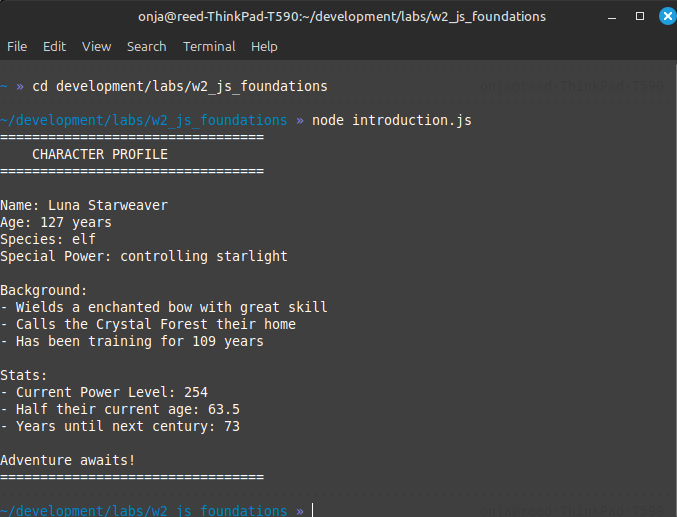
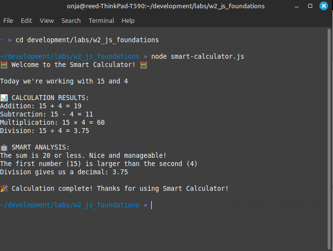

# Part 2: Introduction to JavaScript Scripting

*Time: 1.5 hours*

## From Environment to Action

You've set up your development workspace and run your first JavaScript program. Now it's time to really dive in and start exploring what JavaScript can do. 

Today we'll move from running single commands to writing actual programs that solve problems and respond to input.

## What You'll Learn

- How to experiment and explore using the Node.js REPL
- Writing your first real JavaScript programs
- Understanding how JavaScript thinks about data and logic
- Building scripts that actually do useful things

---

## Part 1: Exploration & Discovery (30 minutes)

### Meet the REPL: Your JavaScript Playground

REPL stands for **Read-Eval-Print Loop**. It's like having a conversation with JavaScript - you type something, JavaScript responds immediately. A REPL session doesn't save your work and doesn't create a file -- it is just for quick experiments directly in the terminal. When you exit the REPL, everything you did is gone!

**Let's start exploring:**

1. Open your terminal and navigate to your scratch folder: `cd ~/development/scratch`
2. Type `node` and press Enter
3. You should see a prompt that looks like `>` - you're now inside the Node.js REPL!

### Your First REPL Experiments

Try typing one line and then pressing enter. See what happens. Do this for each line below (You can skip the comments, which start with `//`):

```javascript
// Basic math
5 + 3
10 - 4
6 * 7
15 / 3

// What about this?
10 / 3
5 + 3 * 2

// Text (we call this a "string")
"Hello, world!"
"My name is " + "Your Name"

// Questions for JavaScript
5 > 3
10 === 10
"hello" === "goodbye"

// Variables - storing information
let myName = "Your Name"
myName
let myAge = 25
myAge
myName + " is " + myAge + " years old"

// JavaScript can remember things
let x = 10
let y = 5
x + y
x * y

// Functions - teaching JavaScript new tricks
function greet(name) {
  return "Hello, " + name + "!"
}

greet("Alice")
greet("Bob")
greet(myName)
```

**Exploration Questions:**
- What happens when you type just a number vs. a number in quotes?
- Try some math with text - what happens with `"5" + "3"`?
- What if you don't use `let` before a variable name?
- Can you create your own function that does math?

**To exit the REPL:** Type `.exit` or press `Ctrl+C` twice

### Reflection Moment

What surprised you most about these experiments? What questions do you have about how JavaScript works?

---

## Understanding JavaScript Operations

Before we build our first script, let's clarify what's happening with those operations you just experimented with:

### String Operations
- **Concatenation with `+`**: When you use `+` with text (strings), JavaScript joins them together
  - `"Hello" + " " + "World"` becomes `"Hello World"`
  - `"My age is " + 25` becomes `"My age is 25"` (JavaScript converts the number to text)

### Math Operations
- **Addition**: `5 + 3` gives you `8`
- **Subtraction**: `10 - 4` gives you `6`
- **Multiplication**: `6 * 7` gives you `42`
- **Division**: `15 / 3` gives you `5`

### The Important Difference
- `5 + 3` = `8` (math addition)
- `"5" + "3"` = `"53"` (string concatenation)

JavaScript treats numbers and text differently! When you put quotes around numbers, they become text, and `+` joins them instead of adding them.

### Comparison Operations
- `5 > 3` asks "is 5 greater than 3?" and gives you `true`
- `10 === 10` asks "are these exactly equal?" and gives you `true`
- `"hello" === "goodbye"` gives you `false`

### Variables
- `let myName = "Alice"` stores the text "Alice" in a container called `myName`
- You can use that container later: `"Hello, " + myName`

---

## Running JavaScript on Your Computer (Not in a Browser!)

Before we build our first script, let's pause and appreciate what's happening here. You're running JavaScript directly on your computer using Node.js when you use the REPL. Next up, we're going to be using Node.js to run individual JavaScript files, which is very similar to the REPL except that you can save the file and run it as many times as you want. There is no browser required for this!

**This is different from HTML/CSS workflow:**
- With HTML/CSS: You wrote files and opened them in a browser
- With Node.js: You write JavaScript files and run them directly on your computer

**The magic command:** `node filename.js`
- This tells your computer: "Hey, run this JavaScript file using Node.js"
- Node.js reads your file and executes the JavaScript code
- The output appears right in your terminal

**Why this matters:**
- JavaScript isn't limited to web pages anymore
- You can build desktop applications, servers, command-line tools
- Same language, new possibilities!

We'll explore JavaScript in browsers later, but for now, enjoy the power of running code directly on your machine.

---

## Part 2: Your First Real Script (30 minutes)

Now let's take what we learned and build something more substantial. We'll create a fictional character profile script that practices all the operations we just learned.

### Activity: Fictional Character Profile Generator

**Create a new file:** `character-profile.js` in your lab folder

> **Note on copy / paste:** In this example and in the future, you can use your own judgement whether to copy and paste or type out the code yourself. Especially when you are learning a new concept or encountering a new technique, typing it out helps you to learn and understand the concepts better. This is actually far more important than just having working code -- the whole point of this course is to learn how to think like a programmer. On the other hand, sometimes you may already understand the concepts, and typing it out can just feel like busy work. Use your judgement!

```javascript
// Fictional Character Profile Generator
// This script creates a profile for an imaginary character

// Store information about your character
let characterName = "Luna Starweaver";
let characterAge = 127; // Fantasy characters can be any age!
let species = "elf";
let magicalPower = "controlling starlight";
let favoriteWeapon = "enchanted bow";
let homeland = "the Crystal Forest";

// Calculate some interesting facts
let yearsOfExperience = characterAge - 18; // Assuming they started training at 18
let powerLevel = characterAge * 2;
let halfAge = characterAge / 2;

// Create the character profile
console.log("=================================");
console.log("    CHARACTER PROFILE");
console.log("=================================");
console.log();
console.log("Name: " + characterName);
console.log("Age: " + characterAge + " years");
console.log("Species: " + species);
console.log("Special Power: " + magicalPower);
console.log();
console.log("Background:");
console.log("- Wields a " + favoriteWeapon + " with great skill");
console.log("- Calls " + homeland + " their home");
console.log("- Has been training for " + yearsOfExperience + " years");
console.log();
console.log("Stats:");
console.log("- Current Power Level: " + powerLevel);
console.log("- Half their current age: " + halfAge);
console.log("- Years until next century: " + (200 - characterAge));
console.log();
console.log("Adventure awaits!");
console.log("=================================");
```

**Your turn:**
1. Customize this script with your own fictional character
2. Run it with: `node character-profile.js` (This runs your JavaScript directly on your computer!) It should look something like this:

  

3. Experiment with changing the values and running it again

---

## Part 3: Building Something Interactive (30 minutes)

Let's step it up and create a script that can respond to different situations. We'll build a simple decision-making calculator.

### Activity: Smart Calculator

**Create a new file:** `smart-calculator.js`

```javascript
// Smart Calculator
// This calculator can do different operations and give helpful responses

console.log("🧮 Welcome to the Smart Calculator! 🧮");
console.log();

// Let's define some numbers to work with
let firstNumber = 15;
let secondNumber = 4;

console.log("Today we're working with " + firstNumber + " and " + secondNumber);
console.log();

// Basic operations
let sum = firstNumber + secondNumber;
let difference = firstNumber - secondNumber;
let product = firstNumber * secondNumber;
let quotient = firstNumber / secondNumber;

console.log("📊 CALCULATION RESULTS:");
console.log("Addition: " + firstNumber + " + " + secondNumber + " = " + sum);
console.log("Subtraction: " + firstNumber + " - " + secondNumber + " = " + difference);
console.log("Multiplication: " + firstNumber + " × " + secondNumber + " = " + product);
console.log("Division: " + firstNumber + " ÷ " + secondNumber + " = " + quotient);
console.log();

// Let's make it smart - give different responses based on results
console.log("🤖 SMART ANALYSIS:");

if (sum > 20) {
  console.log("Wow! The sum is greater than 20. That's a big number!");
} else {
  console.log("The sum is 20 or less. Nice and manageable!");
}

if (firstNumber > secondNumber) {
  console.log("The first number (" + firstNumber + ") is larger than the second (" + secondNumber + ")");
} else if (secondNumber > firstNumber) {
  console.log("The second number (" + secondNumber + ") is larger than the first (" + firstNumber + ")");
} else {
  console.log("Both numbers are equal!");
}

if (quotient === Math.floor(quotient)) {
  console.log("Perfect division! " + firstNumber + " divides evenly into " + secondNumber);
} else {
  console.log("Division gives us a decimal: " + quotient);
}

console.log();
console.log("🎉 Calculation complete! Thanks for using Smart Calculator!");
```

**Experiment with this script:**
1. Run it as-is: `node smart-calculator.js` (Watch your computer execute this JavaScript!) It should something like this:

  
  
2. Change the values of `firstNumber` and `secondNumber`
3. Run it again and see how the responses change
4. Try making the numbers equal - what happens?
5. Try making secondNumber larger than firstNumber

**Notice:** Each time you run `node smart-calculator.js`, your computer executes the entire script from top to bottom. This is different from web pages that stay loaded - your script runs once and finishes.

**Challenge Extensions:**
- Add more operations (maybe calculating percentages?)
- Add more smart responses based on different conditions
- Calculate and display the average of the two numbers
- Add some ASCII art or emoji to make it more fun

---

## Understanding What You Built

Let's reflect on what you just accomplished:

### Key Programming Concepts You Used

1. **Variables**: Storing and reusing information
2. **Operations**: Making calculations and combining text
3. **Conditional Logic**: Making decisions based on data
4. **Output**: Displaying results in a formatted, user-friendly way

### The Power of Scripts

Notice how your scripts:
- **Remember information** (variables)
- **Process that information** (calculations, comparisons)
- **Respond intelligently** (different outputs based on conditions)
- **Present results clearly** (formatted output)

This is the essence of programming: taking input, processing it, and producing meaningful output.

---

## Connecting to the Real World

The scripts you just built use the same fundamental concepts that power:
- Banking apps (calculating balances, interest)
- Social media (personalizing content based on user data)
- Games (responding to player actions)
- Websites (showing different content to different users)

You're thinking like a programmer now!

---

## Practice Challenges (If Time Permits)

Try building one of these mini-scripts:

### 1. Weather Reporter
Create a script that takes a temperature and gives weather advice:
```javascript
let temperature = 75; // Change this value
// Add logic to give different advice based on temperature
```

### 2. Age Calculator
Build a script that calculates interesting facts about someone's age:
```javascript
let birthYear = 2000; // Change this
let currentYear = 2024;
// Calculate age, decades lived, years until milestones, etc.
```

### 3. Text Formatter
Create a script that takes text and formats it in different ways:
```javascript
let message = "hello world";
// Make it uppercase, count letters, reverse it, etc.
```

---

## Reflection Questions

Before moving to the next session:

1. What was most exciting about writing these scripts?
2. How does JavaScript feel different from HTML and CSS?
3. What would you like to build next?
4. Which part felt most challenging, and why?

---

## Looking Ahead

In our next session, we'll dive deeper into **data types and operators** - understanding exactly how JavaScript thinks about different kinds of information and what operations you can perform on them.

Later today, we'll also explore JavaScript in the **browser console** - seeing how the same language works in a different environment. You'll start to understand how Node.js (running on your computer) and browser JavaScript are related but serve different purposes.

You'll understand why `"5" + "3"` gives a different result than `5 + 3`, and how to use this knowledge to build even more powerful programs.

Great work! You're officially scripting with JavaScript on your own computer! 🎉
