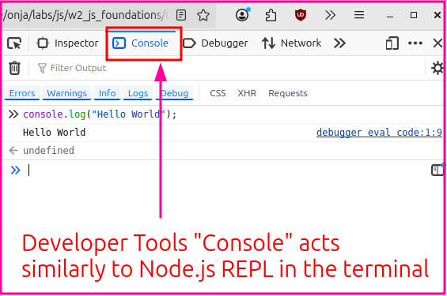
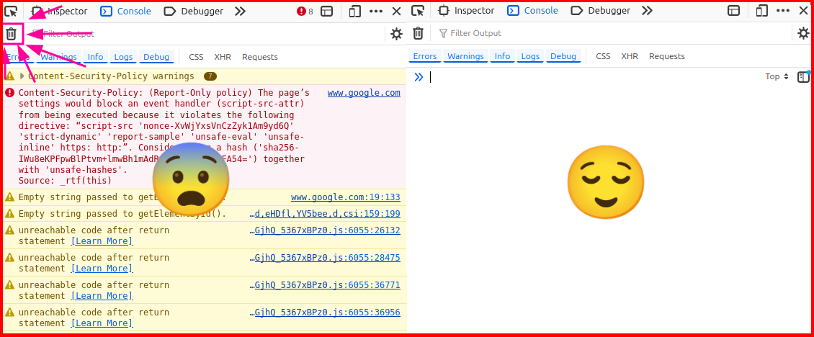
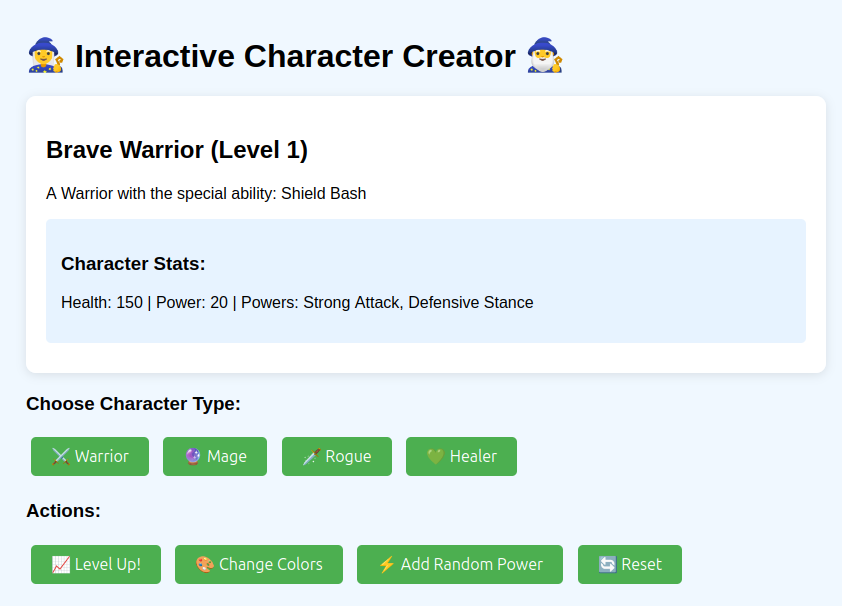

# Part 4: JavaScript Console - Your Browser's Programming Environment

*Time: 1.5 hours*

## Two Worlds, One Language

You've been running JavaScript on your computer with Node.js. Now let's explore JavaScript's original home: the web browser. The amazing thing? It's the same language, but with new superpowers for interacting with webpages.

Today you'll discover that every browser tab is like having a JavaScript REPL that can read and modify the webpage it's displaying.

## What You'll Learn

- Using the browser console as a JavaScript playground
- How webpages become JavaScript objects you can manipulate
- Writing JavaScript that lives inside webpages
- Debugging webpage JavaScript using the console
- Building an interactive webpage from scratch

---

## Part 1: Familiar Territory - Console as REPL (20 minutes)

### Opening Your Browser's JavaScript Console

Let's start with familiar territory - the browser console works just like the Node REPL you know!

1. **Open your web browser** (Chrome, Firefox, Safari, Edge)
2. **Open the developer console**:
   - **Chrome/Edge**: Press `F12` or `Ctrl+Shift+I` (Windows) / `Cmd+Option+I` (Mac)
   - **Firefox**: Press `F12` or `Ctrl+Shift+K` (Windows) / `Cmd+Option+K` (Mac)
   - **Safari**: Press `Cmd+Option+C` (you might need to enable Developer menu first)
3. **Click on the "Console" tab** if it's not already selected



### Same JavaScript, Different Environment

Try these familiar commands in the browser console:

```javascript
// All the same data types and operations work!
5 + 3
"Hello" + " " + "Browser!"
let myName = "Your Name"
myName

// Same operators
10 > 5
typeof "hello"
typeof 42

// Functions work the same way
function greet(name) {
  return "Hello, " + name + "!"
}

greet("Browser JavaScript")

// Arrays and objects too
let colors = ["red", "green", "blue"]
colors[0]

let character = {
  name: "Luna",
  power: "starlight"
}
character.name
```

### Key Insight: Same Language, Different Runtime

- **Node.js**: JavaScript talks to your computer's file system, network, etc.
- **Browser**: JavaScript talks to webpages, user interactions, etc.
- **Both**: Use the same core language (variables, functions, data types)

---

## Part 2: The Magic - Console Talks to Webpages (30 minutes)

### Every Webpage is a JavaScript Object

Here's where it gets exciting! The browser automatically creates JavaScript objects representing everything on the webpage.

**Try this experiment:**

1. **Go to any website** (wikipedia.org works well for these examples!)
2. **In the console, type**: `document`
3. **Press Enter**

What you're seeing is the entire webpage as a JavaScript object!

>**Tip**: You can clear the console anytime with a button at the top of the console. The console can get really messy on some sites! The image below is in Firefox but the button is in a similar spot in all browsers.



### Exploring the Webpage Object

```javascript
// See the webpage title
document.title

// See the current URL
document.URL

// Find elements on the page
document.querySelector("h1")  // Find the first heading
document.querySelector("p")   // Find the first paragraph

// Find all elements of a type
document.querySelectorAll("p")  // Find ALL paragraphs
```

### Changing the Webpage Live!

Now for the really fun part - you can change the webpage using JavaScript:

```javascript
// Change the page title (look at the browser tab!)
document.title = "I'm learning JavaScript!"

// Find a heading and change its text
let heading = document.querySelector("h1")
heading.textContent = "JavaScript is awesome!"

// Change styles
heading.style.color = "red"
heading.style.fontSize = "50px"

// Change the background color of the entire page
document.body.style.backgroundColor = "lightblue"

// Add some fun
document.body.style.fontFamily = "Comic Sans MS"
```

Don't worry, these changes only affect *your current view* of the webpage. They are local to your browser and will disappear if you refresh the page. :)

### Understanding What Just Happened

We are interacting with the **Document Object Model (DOM)** (perhaps you remember this from earlier learning material), which is how browsers represent webpages as objects.

- Every HTML element becomes a JavaScript object
- You can find elements using `document.querySelector()`
- You can change text with `.textContent`
- You can change styling with `.style`
- Changes happen immediately on the webpage!

**Activity**: Pick any website and try changing its colors, text, or fonts using the console. Go wild!

---

## Part 3: JavaScript Lives in Webpages Too (25 minutes)

Now let's create our own webpage with JavaScript built right in. This JavaScript will share the same environment as the console!

### Activity: Build Your Interactive Character Creator



**Create a new file**: `character-creator.html` in your lab folder

You don't need to understand all of the JavaScript yet, though you probably will recognize a lot of it from before! The HTML and CSS should be familiar to you. Read through the file to get a feel for it and then copy and paste the code below into your file.

```html
<!DOCTYPE html>
<html lang="en">
<head>
    <meta charset="UTF-8">
    <meta name="viewport" content="width=device-width, initial-scale=1.0">
    <title>Interactive Character Creator</title>
    <style>
        body {
            font-family: Arial, sans-serif;
            max-width: 800px;
            margin: 0 auto;
            padding: 20px;
            background-color: #f0f8ff;
        }
        .character-display {
            background: white;
            padding: 20px;
            border-radius: 10px;
            margin: 20px 0;
            box-shadow: 0 2px 10px rgba(0,0,0,0.1);
        }
        button {
            background: #4CAF50;
            color: white;
            padding: 10px 20px;
            border: none;
            border-radius: 5px;
            cursor: pointer;
            margin: 5px;
            font-size: 16px;
        }
        button:hover {
            background: #45a049;
        }
        .stats {
            background: #e7f3ff;
            padding: 15px;
            border-radius: 5px;
            margin: 10px 0;
        }
    </style>
</head>
<body>
    <h1>🧙‍♀️ Interactive Character Creator 🧙‍♂️</h1>
    
    <div class="character-display">
        <h2 id="character-name">Click buttons to create your character!</h2>
        <p id="character-description">Your character awaits...</p>
        
        <div class="stats">
            <h3>Character Stats:</h3>
            <p id="character-stats">No character created yet</p>
        </div>
    </div>

    <div>
        <h3>Choose Character Type:</h3>
        <button onclick="createWarrior()">⚔️ Warrior</button>
        <button onclick="createMage()">🔮 Mage</button>
        <button onclick="createRogue()">🗡️ Rogue</button>
        <button onclick="createHealer()">💚 Healer</button>
    </div>

    <div>
        <h3>Actions:</h3>
        <button onclick="levelUp()">📈 Level Up!</button>
        <button onclick="changeColor()">🎨 Change Colors</button>
        <button onclick="addRandomPower()">⚡ Add Random Power</button>
        <button onclick="resetCharacter()">🔄 Reset</button>
    </div>

    <script>
        // Character data - this is accessible in the console too!
        let currentCharacter = {
            name: "",
            type: "",
            level: 1,
            health: 100,
            power: 10,
            specialAbility: "",
            powers: []
        };

        // Character creation functions
        function createWarrior() {
            currentCharacter = {
                name: "Brave Warrior",
                type: "Warrior",
                level: 1,
                health: 150,
                power: 20,
                specialAbility: "Shield Bash",
                powers: ["Strong Attack", "Defensive Stance"]
            };
            updateDisplay();
            console.log("Warrior created!", currentCharacter);
        }

        function createMage() {
            currentCharacter = {
                name: "Wise Mage",
                type: "Mage",
                level: 1,
                health: 80,
                power: 30,
                specialAbility: "Fireball",
                powers: ["Magic Missile", "Spell Shield"]
            };
            updateDisplay();
            console.log("Mage created!", currentCharacter);
        }

        function createRogue() {
            currentCharacter = {
                name: "Sneaky Rogue",
                type: "Rogue",
                level: 1,
                health: 100,
                power: 15,
                specialAbility: "Stealth Strike",
                powers: ["Sneak Attack", "Lock Picking"]
            };
            updateDisplay();
            console.log("Rogue created!", currentCharacter);
        }

        function createHealer() {
            currentCharacter = {
                name: "Kind Healer",
                type: "Healer",
                level: 1,
                health: 120,
                power: 12,
                specialAbility: "Healing Light",
                powers: ["Heal", "Purify"]
            };
            updateDisplay();
            console.log("Healer created!", currentCharacter);
        }

        // Action functions
        function levelUp() {
            if (currentCharacter.name) {
                currentCharacter.level++;
                currentCharacter.health += 20;
                currentCharacter.power += 5;
                updateDisplay();
                console.log("Level up! New stats:", currentCharacter);
                
                // Show level up message
                let nameElement = document.getElementById("character-name");
                nameElement.textContent += " ⭐ LEVEL UP! ⭐";
                setTimeout(() => updateDisplay(), 2000);
            } else {
                alert("Create a character first!");
            }
        }

        function changeColor() {
            let colors = ["#ff6b6b", "#4ecdc4", "#45b7d1", "#96ceb4", "#ffeaa7", "#dda0dd"];
            let randomColor = colors[Math.floor(Math.random() * colors.length)];
            document.body.style.backgroundColor = randomColor;
            console.log("Changed background to:", randomColor);
        }

        function addRandomPower() {
            if (currentCharacter.name) {
                let randomPowers = ["Lightning Strike", "Ice Blast", "Earth Shake", "Wind Gust", 
                                 "Shadow Clone", "Time Slow", "Invisibility", "Strength Boost"];
                let newPower = randomPowers[Math.floor(Math.random() * randomPowers.length)];
                currentCharacter.powers.push(newPower);
                updateDisplay();
                console.log("Added new power:", newPower);
            } else {
                alert("Create a character first!");
            }
        }

        function resetCharacter() {
            currentCharacter = {
                name: "",
                type: "",
                level: 1,
                health: 100,
                power: 10,
                specialAbility: "",
                powers: []
            };
            document.getElementById("character-name").textContent = "Click buttons to create your character!";
            document.getElementById("character-description").textContent = "Your character awaits...";
            document.getElementById("character-stats").textContent = "No character created yet";
            document.body.style.backgroundColor = "#f0f8ff";
            console.log("Character reset!");
        }

        // Update the display
        function updateDisplay() {
            if (currentCharacter.name) {
                document.getElementById("character-name").textContent = 
                    `${currentCharacter.name} (Level ${currentCharacter.level})`;
                
                document.getElementById("character-description").textContent = 
                    `A ${currentCharacter.type} with the special ability: ${currentCharacter.specialAbility}`;
                
                document.getElementById("character-stats").textContent = 
                    `Health: ${currentCharacter.health} | Power: ${currentCharacter.power} | Powers: ${currentCharacter.powers.join(", ")}`;
            }
        }

        // This runs when the page loads
        console.log("Character Creator loaded! Try typing 'currentCharacter' in the console!");
        console.log("You can also call any of the functions directly from the console.");
    </script>
</body>
</html>
```

### Testing Your Webpage

1. **Save the file** in your lab folder
2. **Open it in your browser** (double-click the file, drag it to browser, or type `open character-creator.html` in the terminal)
3. **Open the developer console** (F12)
4. **Try clicking the buttons** and watch the console messages

### The Magic Connection

Notice how:
- Button clicks trigger JavaScript functions
- Those same functions are accessible in the console
- Variables like `currentCharacter` exist in both the webpage and console
- `console.log()` messages from the webpage appear in the console

---

## Part 4: Debugging and Development Workflow (25 minutes)

### Exploring Your Webpage with the Console

With your character creator open, try these in the console:

```javascript
// Access your character data directly
currentCharacter

// Modify your character through the console
currentCharacter.name = "Super " + currentCharacter.name
updateDisplay()

// Call functions directly
createMage()
levelUp()
levelUp()
levelUp()

// Experiment with the webpage elements
document.querySelector("h1").style.color = "purple"
document.querySelector("button").style.fontSize = "20px"

// Add new powers programmatically
// `.push` adds an item to the end of an array -- don't worry, you'll learn more about htis later!
currentCharacter.powers.push("Console Master", "Debug Vision")
updateDisplay()
```

### Adding More Features

Let's add some more functionality. Again, don't worry if you don't understand everything yet! This is just to give you an idea of what's possible. Copy and paste this to your `<script>` section (before the closing `</script>` tag):

```javascript
// New function: Character battle simulator
function battleSimulator(enemyName = "Goblin") {
    if (!currentCharacter.name) {
        console.log("Create a character first!");
        return;
    }
    
    let enemyHealth = 50;
    let battleLog = [];
    
    battleLog.push(`⚔️ ${currentCharacter.name} encounters a ${enemyName}!`);
    battleLog.push(`${currentCharacter.name} Health: ${currentCharacter.health}`);
    battleLog.push(`${enemyName} Health: ${enemyHealth}`);
    
    while (enemyHealth > 0 && currentCharacter.health > 0) {
        // Player attacks
        let playerDamage = Math.floor(Math.random() * currentCharacter.power) + 5;
        enemyHealth -= playerDamage;
        battleLog.push(`💥 ${currentCharacter.name} deals ${playerDamage} damage!`);
        
        if (enemyHealth <= 0) {
            battleLog.push(`🎉 ${enemyName} defeated! ${currentCharacter.name} wins!`);
            break;
        }
        
        // Enemy attacks
        let enemyDamage = Math.floor(Math.random() * 15) + 3;
        currentCharacter.health -= enemyDamage;
        battleLog.push(`💢 ${enemyName} deals ${enemyDamage} damage!`);
        
        if (currentCharacter.health <= 0) {
            battleLog.push(`💀 ${currentCharacter.name} has been defeated...`);
            break;
        }
    }
    
    // Display battle log
    battleLog.forEach(message => console.log(message));
    updateDisplay();
    
    return battleLog;
}

// Function to save character to localStorage (browser storage)
function saveCharacter() {
    localStorage.setItem("savedCharacter", JSON.stringify(currentCharacter));
    console.log("Character saved to browser storage!");
}

function loadCharacter() {
    let saved = localStorage.getItem("savedCharacter");
    if (saved) {
        currentCharacter = JSON.parse(saved);
        updateDisplay();
        console.log("Character loaded from storage:", currentCharacter);
    } else {
        console.log("No saved character found!");
    }
}
```

Hm... we have a BattleSimulator now, but how do we use it? Try this in the console:

```javascript
battleSimulator()
```

We just called the function we added! You can also save and load your character:

```javascript
saveCharacter()
// Refresh the page to clear currentCharacter
loadCharacter()
```

Wouldn't it be nice to have buttons for these new functions? Add these buttons to your HTML inside the `<div>` with the other action buttons:

```html
<button onclick="battleSimulator()">⚔️ Battle Simulator</button>
<button onclick="saveCharacter()">💾 Save Character</button>
<button onclick="loadCharacter()">📂 Load Character</button>
```

### Advanced Console Experiments

In this section we will add some functions **directly in the console** to experiment with. Note that these functions will only exist while the page is open. If you refresh, they will disappear. They are not part of your webpage's JavaScript. If you wanted to keep them, you would need to add them to your HTML file like we did above.

Try these advanced techniques by pasting them into your console and pressing enter:

```javascript
// 1. Character analysis
function analyzeCharacter() {
    console.log("=== CHARACTER ANALYSIS ===");
    console.log("Type:", typeof currentCharacter);
    console.log("Properties:", Object.keys(currentCharacter));
    console.log("Total power score:", 
        currentCharacter.level * 10 + 
        currentCharacter.health + 
        currentCharacter.power
    );
    console.log("Power-to-health ratio:", 
        (currentCharacter.power / currentCharacter.health).toFixed(2)
    );
}

// 2. DOM manipulation
function makePageFancy() {
    // Add some sparkle animation
    document.body.style.animation = "rainbow 2s infinite";
    
    // Create a new style element
    let style = document.createElement("style");
    style.textContent = `
        @keyframes rainbow {
            0% { filter: hue-rotate(0deg); }
            100% { filter: hue-rotate(360deg); }
        }
    `;
    document.head.appendChild(style);
    
    console.log("✨ Page is now fancy! ✨");
}

// 3. Create new elements dynamically
function addSecretButton() {
    let secretButton = document.createElement("button");
    secretButton.textContent = "🔮 Secret Power";
    secretButton.onclick = function() {
        alert("You found the secret! Your character gains mystical powers!");
        currentCharacter.powers.push("Secret Mystical Power");
        updateDisplay();
    };
    document.body.appendChild(secretButton);
    console.log("Secret button added!");
}
```

Now try calling these new functions in the console:

```javascript
analyzeCharacter()
makePageFancy()
addSecretButton()
```

Hopefully this gives you an idea of how JavaScript in your webpage and JavaScript in the console can work together. The key is that they both share the same environment in the browser! The browser console is where you can go to interact with your webpage's JavaScript live.

### Your Development Workflow

Now you understand the complete browser development cycle:

1. **Write HTML/JavaScript** in your files
2. **Open in browser** to see it running
3. **Use console** to test ideas and debug
4. **Modify code** based on what you learned
5. **Refresh browser** to see changes
6. **Repeat** until perfect!

---

## Reflection and Understanding

### What You've Accomplished

Today you discovered that:

- **Browser console = JavaScript REPL** (just like Node.js, but for webpages)
- **Every webpage is a JavaScript object** you can read and modify
- **Webpage JavaScript and console share the same environment**
- **Console is your debugging and experimentation tool**
- **Same language, multiple environments** (Node.js for computer, browser for webpages)

### The Big Picture: JavaScript Everywhere

```
Your Computer (Node.js)     Browser (Webpages)
     ├── File system    ←→      ├── DOM elements
     ├── Terminal       ←→      ├── User interactions  
     ├── Scripts        ←→      ├── Visual interface
     └── npm packages   ←→      └── Web APIs

         Same JavaScript Language!
```

### Questions for Reflection

1. How does the browser console compare to the Node.js REPL?
2. What surprised you most about manipulating webpages with JavaScript?
3. How might you use the console for debugging in the future?
4. What would you like to build next with webpage JavaScript?

---

## Challenges for Further Exploration

If you want to keep experimenting:

1. **Enhance your character creator** with new character types or abilities
2. **Add form inputs** so users can type custom character names
3. **Create a simple game** with multiple characters battling
4. **Experiment with animations** using JavaScript and CSS
5. **Try the localStorage functions** to save/load characters

---

## Looking Ahead

You now understand JavaScript in two environments:
- **Node.js**: For building scripts, servers, and command-line tools
- **Browser**: For interactive webpages and user interfaces

This foundation prepares you for:
- Building more complex web applications
- Understanding how modern websites work
- Debugging JavaScript in any environment
- Learning advanced frameworks and libraries

Congratulations! You've mastered the fundamentals of JavaScript across multiple environments! 🎉

**Don't forget to commit and push your work to your forked repository!**
