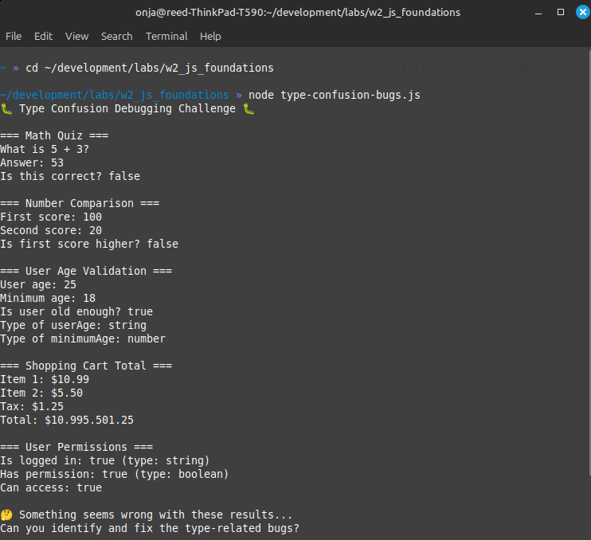

# Part 3: JavaScript Data Types and Operators

*Time: 1.5 hours*

## From Experiments to Understanding

You've been experimenting with JavaScript in the REPL and building scripts. Now let's step back and understand what you've actually been doing - you've been working with different **types** of data and using **operators** to manipulate them.

In this lesson we'll make explicit what you've been learning intuitively, show you more of JavaScript's power, and help you avoid common type-related traps.

## What You'll Learn

- The types of data you've already been using (and their official names)
- More operators to manipulate and compare data
- A taste of JavaScript's more powerful data types
- How type confusion creates bugs (and how to avoid them)
- A preview of future tools that prevent type mistakes

---

## Part 1: You're Already Using Types! (30 minutes)

### Naming What You Know

Let's look at the different kinds of data you've been working with:

**Open the Node REPL** (run `node` in your terminal -- it doesn't really matter what directory you're in since the REPL doesn't create or need any files) and try these:

```javascript
// You've been using NUMBERS
42
3.14
-17
0

// You've been using STRINGS (text)
"Hello, world!"
"Luna Starweaver"
"42"  // This is text that looks like a number!

// You've been using BOOLEANS (true/false)
true
false
5 > 3
"hello" === "hello"
```

### The Big Three: JavaScript's Basic Types

1. **Number**: Any numeric value (`42`, `3.14`, `-17`)
2. **String**: Text data wrapped in quotes (`"hello"`, `"42"`, `"true"`)
3. **Boolean**: True or false values (`true`, `false`)

**Key insight**: Notice how `42` (number) and `"42"` (string) are different types, even though they look similar!

### Operators: Actions You Can Perform

You've been using operators without realizing it. Let's organize them:

#### Arithmetic Operators (for Numbers)
```javascript
// In the REPL, try these:
10 + 5    // Addition
10 - 5    // Subtraction
10 * 5    // Multiplication
10 / 5    // Division
10 % 3    // Modulo (remainder) - gives you 1
```

#### String Operators
```javascript
// String concatenation
"Hello" + " " + "World"
"My age is " + 25  // JavaScript converts 25 to "25"

// You can also use template literals (modern way)
let name = "Alice"
`Hello, ${name}!`  // Try this in the REPL
```

#### Comparison Operators
```javascript
// These always return true or false
5 > 3        // Greater than
5 < 3        // Less than
5 >= 5       // Greater than or equal
5 <= 3       // Less than or equal
5 === 5      // Exactly equal
5 !== 3      // Not equal
```

#### Assignment Operators
```javascript
let x = 10        // Basic assignment
x += 5           // Same as: x = x + 5
x -= 3           // Same as: x = x - 3
x *= 2           // Same as: x = x * 2
```

### Understanding `typeof`

JavaScript can tell you what type something is:

```javascript
// Try these in the REPL:
typeof 42           // "number"
typeof "hello"      // "string"
typeof true         // "boolean"
typeof (5 > 3)      // "boolean"
```

**Activity**: In the REPL, use `typeof` to check the type of different values. What happens with `typeof "42"`?

> Remember: to exit the REPL, type `.exit` and hit Enter or press `Ctrl + C` twice. This will get you back to your terminal where you can navigate as normal.

---

## Part 2: A Taste of JavaScript's Power (20 minutes)

Beyond the basic types, JavaScript has more powerful ways to organize data. You'll learn these in detail later, but let's get a preview (try all of this in the REPL):

### Arrays: Lists of Things

```javascript
// An array is a list of values
let colors = ["red", "green", "blue"]
let numbers = [1, 2, 3, 4, 5]
let mixed = ["Alice", 25, true]  // Arrays can hold different types!

// You can access items by position (starting from 0)
colors[0]  // "red"
colors[1]  // "green"

// You can find out how many items are in the array
colors.length  // 3
```

### Functions: Reusable Instructions

```javascript
// A function is a set of instructions you can reuse
function greet(name) {
  return "Hello, " + name + "!"
}

greet("Alice")  // "Hello, Alice!"
greet("Bob")    // "Hello, Bob!"

// Functions can work with any type
function double(number) {
  return number * 2
}

double(5)   // 10
double(3.5) // 7
```

### Objects: Bundles of Related Information

```javascript
// An object groups related data together
let character = {
  name: "Luna",
  age: 127,
  species: "elf",
  isAlive: true
}

// Access properties with dot notation
character.name    // "Luna"
character.age     // 127
```

**Quick Exploration**: Try creating your own array of favorite foods, a simple function that adds two numbers, or an object describing a book.

---

## Part 3: When Types Cause Trouble (25 minutes)

Now let's experience how type confusion creates bugs. We'll build a script with several type-related problems and then fix them.

### Activity: Debug the Type Confusion Script

**Create a new file:** `type-confusion-bugs.js` in your lab folder

```javascript
// Type Confusion Debugging Exercise
// This script has several type-related bugs. Can you find and fix them?

console.log("🐛 Type Confusion Debugging Challenge 🐛");
console.log();

// Bug 1: Addition vs Concatenation
console.log("=== Math Quiz ===");
let mathAnswer = "5" + "3";  // We want to add 5 + 3
console.log("What is 5 + 3?");
console.log("Answer: " + mathAnswer);
console.log("Is this correct? " + (mathAnswer === 8));
console.log();

// Bug 2: String Comparison Surprises
console.log("=== Number Comparison ===");
let firstScore = "100";
let secondScore = "20";
console.log("First score: " + firstScore);
console.log("Second score: " + secondScore);
console.log("Is first score higher? " + (firstScore > secondScore));
console.log();

// Bug 3: Unexpected Type Conversion
console.log("=== User Age Validation ===");
let userAge = "25";  // This came from user input
let minimumAge = 18;
let isOldEnough = userAge >= minimumAge;
console.log("User age: " + userAge);
console.log("Minimum age: " + minimumAge);
console.log("Is user old enough? " + isOldEnough);
console.log("Type of userAge: " + typeof userAge);
console.log("Type of minimumAge: " + typeof minimumAge);
console.log();

// Bug 4: Calculation Gone Wrong
console.log("=== Shopping Cart Total ===");
let item1Price = "10.99";
let item2Price = "5.50";
let tax = 1.25;
let total = item1Price + item2Price + tax;
console.log("Item 1: $" + item1Price);
console.log("Item 2: $" + item2Price);
console.log("Tax: $" + tax);
console.log("Total: $" + total);
console.log();

// Bug 5: Boolean Logic Confusion
console.log("=== User Permissions ===");
let isLoggedIn = "false";  // This came from a form
let hasPermission = true;
let canAccess = isLoggedIn && hasPermission;
console.log("Is logged in: " + isLoggedIn + " (type: " + typeof isLoggedIn + ")");
console.log("Has permission: " + hasPermission + " (type: " + typeof hasPermission + ")");
console.log("Can access: " + canAccess);
console.log();

console.log("🤔 Something seems wrong with these results...");
console.log("Can you identify and fix the type-related bugs?");
```

### Your Debugging Mission

1. **Run the script**: `node type-confusion-bugs.js`. It should look like this:

    

2. **Analyze the output**: What looks wrong?
3. **Identify the bugs**: Where are types being mixed up?
4. **Fix the bugs**: Change the code to get the expected results
5. **Test your fixes**: Run the script again

### Expected Correct Results

After fixing the bugs, you should see:
- Math quiz: 5 + 3 = 8 (not "53")
- Number comparison: 100 is indeed greater than 20
- Age validation: User is old enough (proper number comparison)
- Shopping cart: Proper numeric total (not string concatenation)
- User permissions: Proper boolean logic

### The Fixes (Try This Yourself First!)

<details>
<summary>Click here only after you've tried fixing them yourself!</summary>

```javascript
// Fix 1: Convert strings to numbers for math
let mathAnswer = 5 + 3;  // Remove quotes or use Number("5") + Number("3")

// Fix 2: Convert strings to numbers for proper comparison
let firstScore = 100;    // Remove quotes
let secondScore = 20;    // Remove quotes

// Fix 3: Convert user input to number
let userAge = Number("25");  // Or just 25

// Fix 4: Convert price strings to numbers
let item1Price = Number("10.99");  // Or just 10.99
let item2Price = Number("5.50");   // Or just 5.50

// Fix 5: Convert string to boolean
let isLoggedIn = false;  // Remove quotes or use Boolean("false") carefully
```
</details>

---

## Part 4: Future Power - Type Safety (15 minutes)

### The Problem You Just Experienced

Type confusion bugs are extremely common in JavaScript. You just experienced how easy it is to accidentally:
- Add strings when you meant to add numbers
- Compare strings when you meant to compare numbers
- Mix different types in unexpected ways

### A Solution: TypeScript

In a few weeks, you'll learn about **TypeScript** - a version of JavaScript that helps prevent these exact problems.

Here's a preview of how TypeScript would have caught these bugs:

```typescript
// TypeScript lets you specify what type a variable should be
let userAge: number = 25;        // This MUST be a number
let userName: string = "Alice";  // This MUST be a string
let isActive: boolean = true;    // This MUST be true or false

// TypeScript would give you an error if you tried:
let userAge: number = "25";  // ❌ Error! String can't be assigned to number
```

Typescript also provides type safety for functions, objects, and more, which you will learn about later. It is a powerful tool for building large, reliable applications where you can feel confident everything is working how you expect it to. The type problems we experienced now are just a small taste of the kinds of issues that can arise in larger applications. Typescript will be your friend!

### Building Good Type Habits Now

Even though you're using regular JavaScript, you can start building habits that will make TypeScript easy later:

1. **Be conscious of types**: Ask yourself "what type is this variable?"
2. **Convert types explicitly**: Use `Number()`, `String()`, `Boolean()` when needed
3. **Use meaningful variable names**: `userAge` (suggests number) vs `age` (could be anything)
4. **Test your assumptions**: Use `typeof` to check types when debugging

### Why This Matters

Type-aware programming helps you:
- Catch bugs before they reach users
- Write more predictable code
- Communicate your intentions clearly
- Build larger, more maintainable applications

---

## Reflection and Practice

### What You've Accomplished

Today you:
- Made explicit the types you've been using intuitively
- Learned more operators for working with data
- Got a preview of JavaScript's more powerful data structures
- Experienced type-related bugs firsthand and learned to fix them
- Prepared your mind for type-safe programming with TypeScript

### Practice Challenges (If Time Permits)

1. **Type Detective**: Create variables with different types and use `typeof` to verify them
2. **Calculator with Type Safety**: Build a calculator that converts string inputs to numbers
3. **Data Type Explorer**: Experiment with arrays, functions, and objects in the REPL

### Questions for Reflection

1. Which type confusion bug surprised you most?
2. How might thinking about types change how you write code?
3. What questions do you have about the data types you previewed?

---

## Looking Ahead

In our next session, we'll explore the **JavaScript Console** in your browser - seeing how the same language and concepts work in a different environment. You'll understand how Node.js (running on your computer) and browser JavaScript are related but serve different purposes.

You now have the foundation to understand why `console.log()` works both in Node.js and in browser consoles, and how the same type concepts apply in both environments.

Great work! You're building a solid understanding of how JavaScript thinks about data! 🎉
