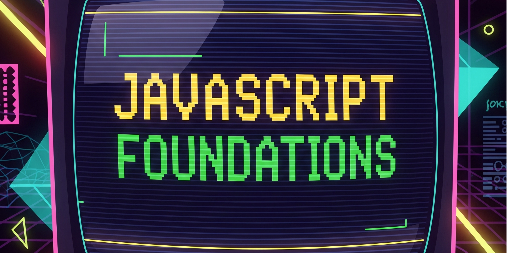

# JavaScript Foundations Lab Instructions

This directory contains the detailed instructions and tutorials for the JavaScript Foundations Lab. Work through these materials in order, completing all activities and exercises.

## 📋 How to Use These Materials

1. **Complete each part in sequence** - The parts build upon each other
2. **Take your time** - Each part has an estimated time, but don't rush
3. **Practice as you go** - Try the examples and complete all activities
4. **Save your work** - Create the required files in the main lab directory (one level up)
5. **Test everything** - Make sure your code runs before moving on

## 📚 Lab Parts

### [Part 1: Setting Up Your JavaScript Development Environment](./01_environment_setup.md)
**Time: 1 hour**
- Understand the tools that power JavaScript development
- Set up your workspace with proper organization
- Learn about terminals, shells, and development workflow
- Connect the tools you've been using to their underlying purpose

### [Part 2: Introduction to JavaScript Scripting](./02_js_scripting.md)
**Time: 1.5 hours**
- Explore JavaScript interactively with the Node.js REPL
- Write your first real JavaScript programs
- Build a fictional character profile generator
- Create a smart calculator with conditional logic
- Understand how Node.js runs JavaScript on your computer

### [Part 3: JavaScript Data Types and Operators](./03_data_types_operators.md)
**Time: 1.5 hours**
- Master JavaScript's core data types (numbers, strings, booleans)
- Learn essential operators for manipulation and comparison
- Preview more powerful data structures (arrays, functions, objects)
- Debug common type-related errors through hands-on exercises
- Prepare for future learning with TypeScript concepts

### [Part 4: JavaScript Console - Your Browser's Programming Environment](./04_js_console.md)
**Time: 1.5 hours**
- Use the browser console as a JavaScript playground
- Manipulate webpages live using JavaScript
- Build an interactive character creator webpage
- Understand the connection between webpage JavaScript and console
- Master the browser development workflow

## � Tips for Success

- **Read carefully** - The instructions contain important details and explanations
- **Practice hands-on** - Type the code yourself, don't just read it
- **Experiment** - Try modifying examples to see what happens
- **Ask questions** - Use your development community for help when stuck
- **Take breaks** - Complex concepts need time to sink in

## 📁 Files You'll Create

As you work through the lab parts, you'll create these files in the main directory:

```
../character-profile.js        # From Part 2
../smart-calculator.js         # From Part 2  
../type-confusion-bugs.js      # From Part 3 (with your fixes)
../character-creator.html      # From Part 4
```

**Important:** Save your files in the main lab directory (one level up from here), not in this `lab/` folder.

---

*Ready to start? Begin with [Part 1: Environment Setup](./01_environment_setup.md)*
